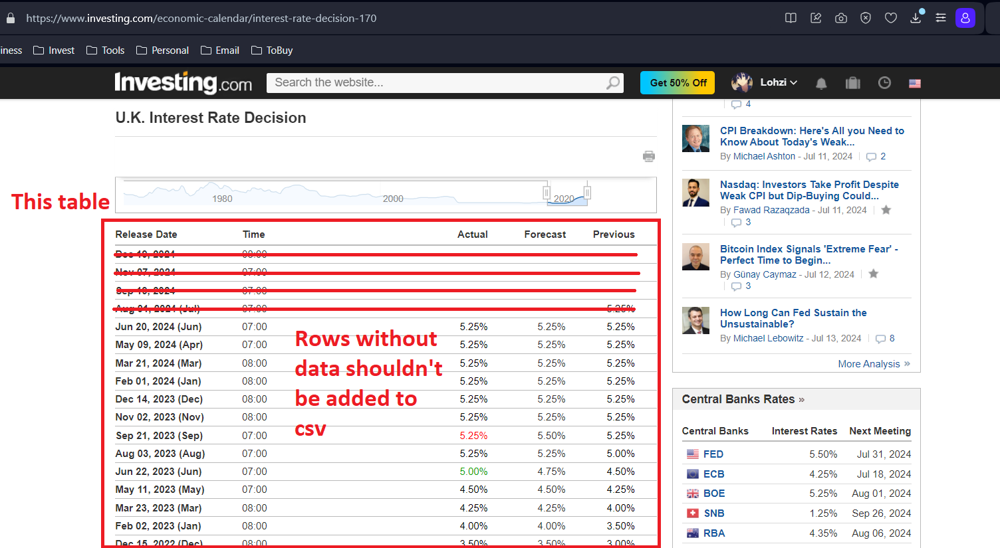
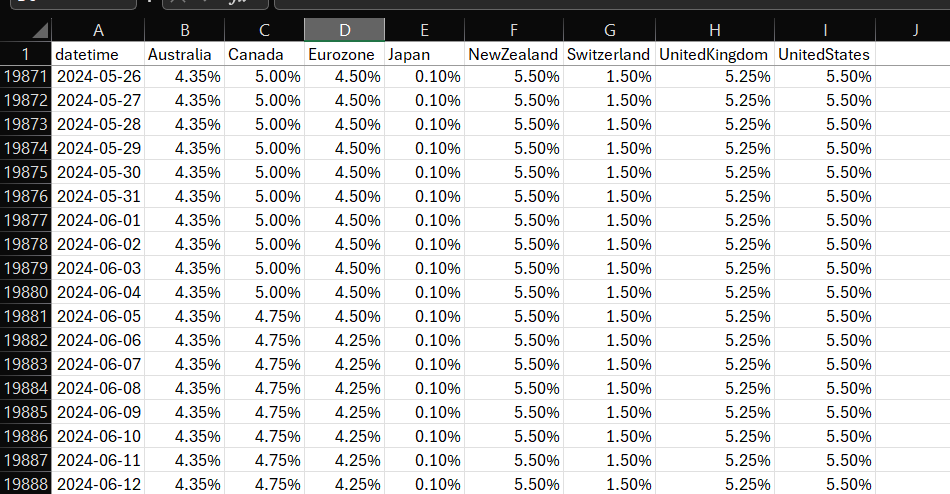

Overview
--------

Simple script to combine all interest rate data copied from 'investing.com' into a single csv file.

Prerequisite
------------

- Git
- NodeJs

Setup
-----

1. Clone the repo

   ```
   git clone 
   ```

2. Install dependencies

   ```
   npm install
   ```

Usage
-----

1. Manually create csv(s) by copy and pasting the interest rate data table obtained form 'investing.com'.

   

2. Run the script

   ```
   node main.js "--folder='path/to/folder/containing/interest-rate-csv'"

   E.g.
   node main.js "--folder='D:\OneDrive\Documents HDD\Investment\forex\interest rates'"
   ```

3. The combined interest rate csv will be located in `path/to/folder/containing/interest-rate-csv` with `Interest Rates.csv` as filename.

   
   